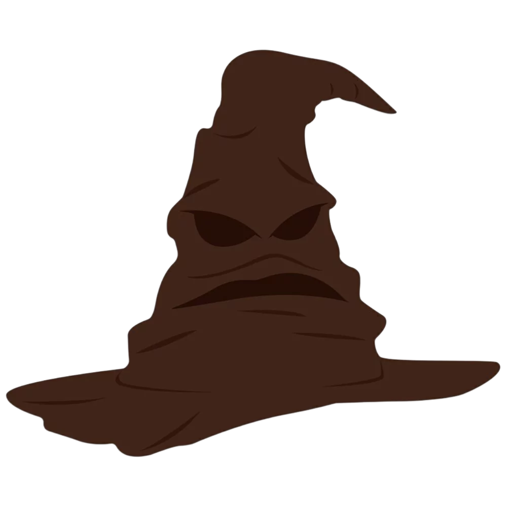

<div align="center">



# 🎩 Chapéu Seletor

**Descubra sua casa em Hogwarts com o Chapéu Seletor mágico**

[](https://flutter.dev)
[](https://dart.dev)
[](https://m3.material.io)
[](https://github.com)

</div>

---

## 📖 Sobre o Projeto

**Chapéu Seletor** é um aplicativo Flutter que recria a icônica cerimônia de seleção de casas de Hogwarts do universo Harry Potter. Com um toque no botão, o Chapéu Seletor "pensa" por alguns segundos e revela aleatoriamente a casa do bruxo: **Grifinória**, **Sonserina**, **Lufa-Lufa** ou **Corvinal**.

O projeto demonstra o uso de máquina de estados com `enum` para controle de fluxo assíncrono na UI, componentização Flutter com `StatelessWidget` reutilizáveis, e tipografia personalizada com a fonte **HarryPotter** aplicada ao cabeçalho.

---

## ✨ Funcionalidades

| Funcionalidade | Descrição |
|---|---|
| ✅ **Seleção aleatória de casa** | Escolhe entre Grifinória, Sonserina, Lufa-Lufa e Corvinal |
| ✅ **Animação de estados** | Botão com 3 estados visuais: ocioso, pensando e resultado |
| ✅ **Transição automática** | Exibe o resultado por 3 segundos e retorna ao estado inicial |
| ✅ **Tipografia temática** | Fonte "HarryPotter" no cabeçalho para imersão no universo HP |
| ✅ **Assets temáticos** | Imagens dos brasões das quatro casas de Hogwarts |
| ✅ **Multiplataforma** | Android, iOS, Web, Windows, Linux e macOS |

---

## 🏰 As Casas de Hogwarts

| Casa | Característica |
|---|---|
| 🦁 **Grifinória** | Coragem, bravura e determinação |
| 🐍 **Sonserina** | Astúcia, ambição e liderança |
| 🦡 **Lufa-Lufa** | Lealdade, paciência e trabalho duro |
| 🦅 **Corvinal** | Inteligência, criatividade e sabedoria |

---

## 🔄 Fluxo da Aplicação

```
Usuário abre o app
        ↓
Tela inicial com cabeçalho "Hogwarts"
e botão "Descobrir minha casa"  [SortingState.idle]
        ↓
Usuário pressiona o botão
        ↓
Botão exibe "Pensando ..."  [SortingState.sorting]
aguarda 3 segundos (Future.delayed)
        ↓
Casa sorteada aleatoriamente é exibida  [SortingState.result]
ex: "Grifinória"
        ↓
Aguarda mais 3 segundos
        ↓
Retorna ao estado inicial  [SortingState.idle]
```

---

## 🏗️ Arquitetura

O projeto é organizado com **componentização Flutter** e controle de estado local via `setState`. O fluxo de seleção é gerenciado por uma **máquina de estados** com `enum SortingState`:

```
SortingState
   ├── idle     → Estado ocioso, botão habilitado
   ├── sorting  → Processando, botão desabilitado
   └── result   → Resultado exibido, botão desabilitado
```

---

## 📁 Estrutura do Projeto

```
sorting_hat/
├── lib/
│   ├── main.dart                        # Entry point + SortingHatScreen (estado principal)
│   └── components/
│       ├── sorting_button.dart          # Botão com máquina de estados (SortingState)
│       ├── hogwarts_header.dart         # Header composto com logo e subtítulo
│       └── hogwarts_logo.dart           # Texto com fonte HarryPotter customizada
├── assets/
│   ├── images/
│   │   ├── sorting_hat.png              # Chapéu Seletor principal
│   │   ├── sorting_hat_sticker.png      # Versão sticker
│   │   ├── icone_chapeu_seletor.png     # Ícone do botão
│   │   ├── harry_potter_logo.png        # Logo HP (light)
│   │   ├── harry_potter_logo_white.png  # Logo HP (dark)
│   │   ├── hogwarts_2.png               # Imagem de Hogwarts
│   │   ├── gryffindor_1/2.png           # Brasão Grifinória
│   │   ├── slytherin_1/2.png            # Brasão Sonserina
│   │   ├── hufflepuff_1/2.png           # Brasão Lufa-Lufa
│   │   └── ravenclaw_1/2.png            # Brasão Corvinal
│   └── font/
│       ├── harryp__.TTF                 # Fonte HarryPotter (aplicada no logo)
│       ├── cinzel_regular/bold/black.otf
│       └── cinzel_decorative_*.otf      # Família Cinzel Decorative
├── android/                             # Configurações Android
├── ios/                                 # Configurações iOS
├── web/                                 # Configurações Web (PWA)
├── windows/                             # Runner Windows
├── linux/                               # Runner Linux
├── macos/                               # Runner macOS
└── pubspec.yaml
```

---

## 🛠️ Tecnologias Utilizadas

- **[Flutter](https://flutter.dev)** — Framework UI multiplataforma
- **[Dart 3.8+](https://dart.dev)** — Linguagem de programação
- **Material Design** — Componentes visuais (`ElevatedButton`, `Scaffold`)
- **`dart:math`** — Sorteio aleatório da casa via `Random`
- **Fonte HarryPotter** — Tipografia customizada (`.TTF`) registrada no `pubspec.yaml`
- **Família Cinzel** — Fontes decorativas incluídas nos assets

---

## 🧩 Componentes

### `SortingButton`
Botão principal com estado visual reativo. Recebe `SortingState` e um callback `onPressed`. Desabilita automaticamente durante `sorting` e `result`, exibindo texto contextual em cada estado. Utiliza a cor `#5D4037` (marrom mogno) com ícone do chapéu em branco.

### `HogwartsHeader`
Componente de cabeçalho que compõe `HogwartsLogo` com o subtítulo "e o chapéu seletor".

### `HogwartsLogo`
Renderiza o título do app com a fonte customizada `HarryPotter` em tamanho 96.

---

## 🚀 Como Executar

### Pré-requisitos

- Flutter SDK `^3.8.x` instalado
- Dart SDK `^3.8.1`
- Android Studio ou VS Code com extensão Flutter
- Dispositivo físico ou emulador configurado

### Passo a passo

```bash
# 1. Clone o repositório
git clone https://github.com/seu-usuario/sorting_hat.git

# 2. Acesse o diretório do projeto
cd sorting_hat

# 3. Instale as dependências
flutter pub get

# 4. Execute o projeto
flutter run
```

### Targets específicos

```bash
# Android
flutter run -d android

# Web
flutter run -d chrome

# Windows
flutter run -d windows
```

---

## 📦 Dependências

| Pacote | Versão | Uso |
|---|---|---|
| `flutter` | SDK | Framework principal |
| `cupertino_icons` | `^1.0.8` | Ícones estilo iOS |
| `flutter_lints` | `^5.0.0` | Análise estática de código |

---


## 👤 Autor

Desenvolvido por **João Victor** — [@QoreLab Solutions](https://qorelab.com.br)

---

<div align="center">

⚡ *"It is our choices that show what we truly are, far more than our abilities."* — Albus Dumbledore

Feito com ❤️ e Flutter · Chapéu Seletor © 2025

</div>


## Telas


